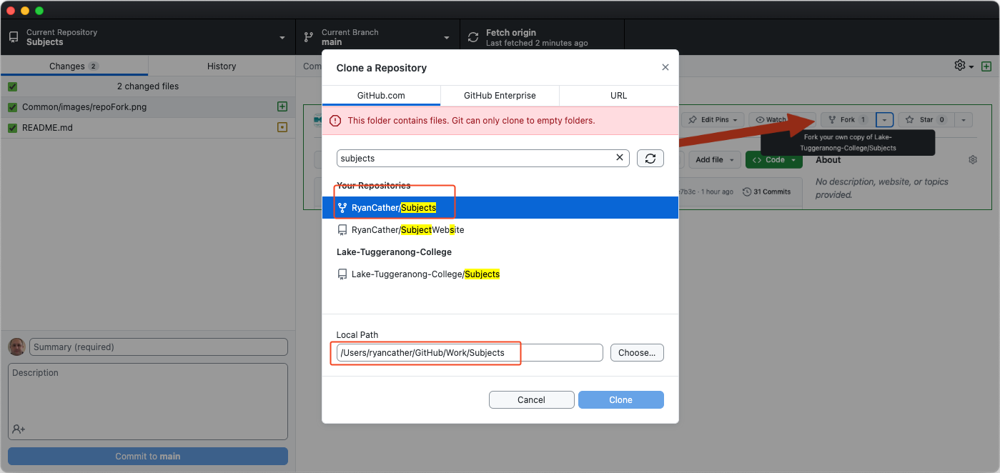
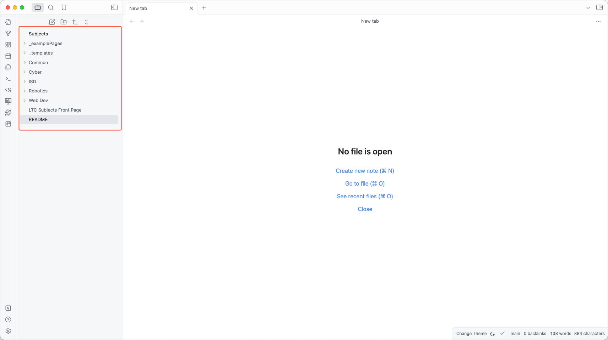

# LTC Holocron

You may fork this repository and suggest changes (via Pull Requests) 

## How to Use This Repository

Fork the repository, this creates a copy of the repository into your GitHub account. You can make changes to the repository in your account.

Clone the repository to your computer using GitHub Desktop (or any method).

> Note the directory that you cloned the repository into. 

Open Obsidian, and open the repository folder as a vault.

## Update your fork

Periodically, there may be updates to the main repository. In your fork, sync the changes which will merge the updates with your repository. **This can be done through GitHub Desktop or Obsidian**, or any other Git method.

First, make and save changes within Obsidian.

### Github Desktop

Select the files you wish to commit, add a comment to explain the changes, then press `Commit To Main`.

Then push the changes to your GitHub repository

## Update the Main documentation

If you need to update the repository, commit and push the changes to your fork, then create a pull request. If your changes are required, your teacher will merge the changes into the main repository. All forks will then be able to update their forks.
